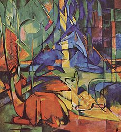
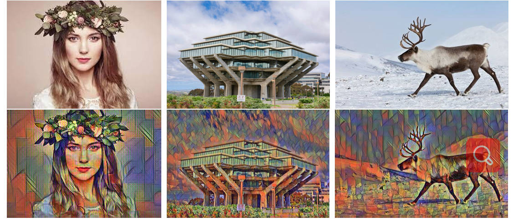

# ReadME
This repository contains a pytorch implementation of an algorithm for artistic style transfer.
The algorithm can be used to mix the content of an image with the style of another image. 


## Env Setup
 
 `pip install -r requirements.txt` 

## Training Data 

Download [COCO](http://images.cocodataset.org/zips/train2014.zip) . save the data in `data/coco/`. 


## Run
If you would like to use `visdom`, run the following command to start the visdom server.
```
nohup python -m visdom.server
```


Command:
```
Usage： python main.py FUNCTION --key=value --key2=value2 ..
```

- Train
```bash
python main.py train --use-gpu --data-root=data --batch-size=2
```

- Style transfer

You may download the pretrained model  `transformer.pth` from [here](https://yun.sfo2.digitaloceanspaces.com/pytorch_book/pytorch_book/transformer.pth). 
```bash
python main.py stylize  --model-path='expressionism.pth' \
                 --content-path='reindeer.jpg'\  
                 --result-path='output.png'\  
                 --use-gpu=False
```

Available args:
```python
    # General Args
    use_gpu = True 
    model_path = None # pretrained model path 
    
    # Train Args
    image_size = 256 # image crop_size for training
    batch_size = 8  
    data_root = 'data/' # dataset root：$data_root/coco/a.jpg
    num_workers = 4 # dataloader num of workers
    
    lr = 1e-3
    epoches = 2 # total epoch to train
    content_weight = 1e5 # weight of content_loss  
    style_weight = 1e10 # weight of style_loss

    style_path= 'style.jpg' # style image path
    env = 'neural-style' # visdom env
    plot_every=10 # visualize in visdom for every 10 batch

    debug_file = '/tmp/debugnn' # touch $debug_fie to interrupt and enter ipdb 

    # Test Args
    content_path = 'input.png' # input file to do style transfer [for test]
    result_path = 'output.png' # style transfer result [for test]
   
```

## Example

Style image:



Transform Result:


To train more styles, try different style images by `--style-path=mystyle.png`


